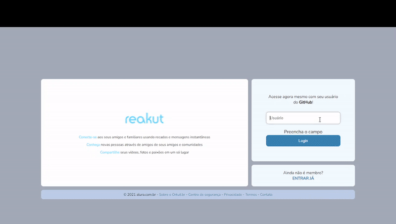

<h1 align="center">Reakut</h1>

<p align="center">Projeto criado na Imersão React da Alura</p>

<p align="center">
  
</p>

<h1 align="left">🎯 O projeto </h1>

<p> O Reakut é uma cópia do antigo Orkut com React! <br/>
Essa aplicação foi desenvolvida durante a Imersão React da Alura </p>

<h1 align="left">🛠️ Tecnologias </h1>

- [React](https://pt-br.reactjs.org/)
- [Styled Components](https://styled-components.com/)
- [Next.js](https://nextjs.org/)
- [DatoCMS](https://www.datocms.com/)

<h1 align="left">⚙️ Instalação </h1>

### 🔙 Pré-requisitos

Antes de começar, você vai precisar ter instalado em sua máquina as seguintes ferramentas:
[Git](https://git-scm.com), [Node.js](https://nodejs.org/en/) e [Yarn](https://yarnpkg.com/). </br>
Além disso é bom ter um editor para trabalhar com o código como o [VSCode](https://code.visualstudio.com/)

### 🔽 Clonando o repositório
```bash
$ git clone https://github.com/victorsantss/alurakut.git
```

### 🖥️ Iniciando a aplicação

```bash
# Acesse a pasta do projeto no terminal/cmd
$ cd NLW-6-Firebase

# Instale as dependências
$ yarn install

# Execute a aplicação
$ yarn start

# O servidor inciará na porta:3000 - acesse <http://localhost:3000>
```

### 🔗 Link do projeto online

[Letmeask](https://alurakut-rho-silk.vercel.app/login)

<hr />

<p align="center">This project was made with 💙 by Victor Santos</p>
